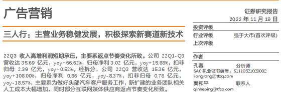
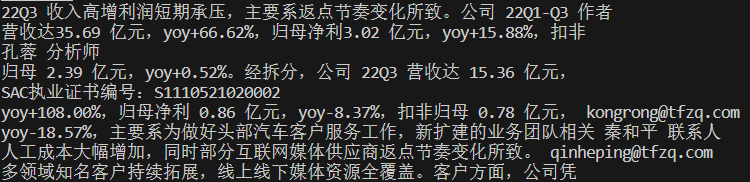
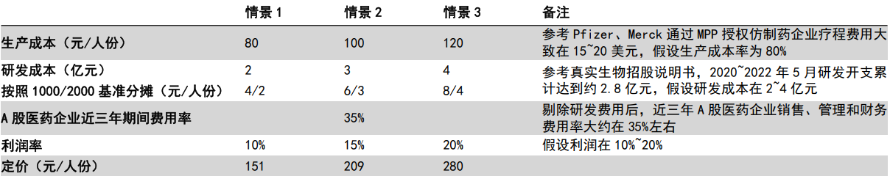
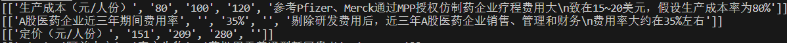
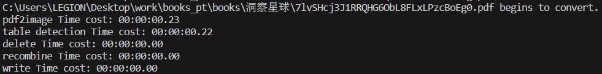
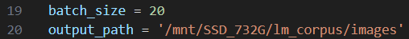
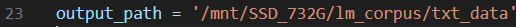
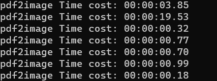
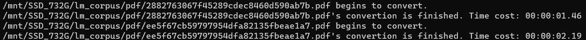

# <center>pdf解析</center>

这里使用的pdf解析工具主要为**pdfplumber**，但是直接使用pdfplumber的效果并不够理想。例如对于下面一个pdf：



如果直接使用pdfplumber而不做其他处理，提取出的文字会保持原来的排版，导致语义上的混乱。



而且pdfplumber对表格的识别能力较为有限，只能识别出非常规范的表格，对于缺少部分框线的表格，只能识别一部分内容或者无法识别。例如下面pdf中的表格，pdfplumber只能识别出一部分。



识别结果：



因此，需要使用更准确的表格识别方法，以及对提取的文本进行后处理。


## CPU + 无缓冲区 

对应程序为**pdf2txt.py**。

### 1.安装第三方库

建议通过conda创建虚拟环境，其中·：

cuda和pytorch根据实际情况安装

pdf2image库：

- windows系统参考：https://github.com/Belval/pdf2image

- linux系统：

```python
conda install -c conda-forge poppler
pip install pdf2image
```

其他基本可通过 **pip install xxx** 安装。


### 2.确定输入和输出路径

输入路径为要处理的pdf的存放路径，输出路径为处理完后的文本的存放路径。例如

input_str = /mnt/SSD_732G/lm_corpus/pdf

output_str = /mnt/SSD_732G/lm_corpus/txt

该程序会自动处理输入路径下**所有**的pdf，包括子目录下的pdf。


### 3.在终端运行命令

在终端中运行命令：**python pdf2txt.py input_dir output_dir**，其中input_dir和output_dir分别对应上面的输入路径和输出路径。

例如：

```
python pdf2txt.py  /mnt/SSD_732G/lm_corpus/pdf /mnt/SSD_732G/lm_corpus/txt
```

等待程序运行结束。

第一次运行会先自动下载要用的模型，如果网络不好会出现连接错误等问题，重新运行命令直到程序正常运行。显示下面的文字即运行成功。



为了加快所有pdf的处理，可以根据实际CPU和GPU的使用情况，**修改输入路径，在多个终端中运行该程序，**同时处理不同批量的pdf。


## CPU + GPU + 缓冲区 

对应程序为**pdf2image.py、image2txt.py、redis_client.py**。

在无缓冲区的程序中，主要的耗时有两部分：将pdf转为图片，以及从图片中识别表格。前者耗费较多的CPU，而后者可以利用GPU加速（程序中已经采用了这个方法）。但这两部分是轮流执行的，还没有较好地利用计算资源。

为了进一步加快pdf的处理，这里按照生产者-消费者模式，设置了一个缓冲区。pdf2image.py作为生产者，将pdf转为图片，并将图片存放在指定路径，同时每处理一个pdf就在缓冲区中放入一个对应图片路径的列表。image2txt.py作为消费者，从缓冲区中取出一个队列，根据队列中的图片路径读取图片，识别表格以及提取文字，最后生成文本存放在指定路径。


### 1.安装第三方库

建议通过conda创建虚拟环境，其中·：

cuda和pytorch根据实际情况安装

pdf2image库：

- windows系统参考：https://github.com/Belval/pdf2image

- linux系统：

```python
conda install -c conda-forge poppler
pip install pdf2image
```

其他基本可通过 **pip install xxx** 安装。


### 2.安装redis

具体可参考：https://www.runoob.com/redis/redis-install.html


### 3.修改程序

**pdf2image.py:**

该程序已使用多进程，根据要处理的pdf的数量以及要使用的进程数，修改程序中的batch_size，同时修改转换后的图片的存放路径。



batch_size的计算方法为
$$
batch\_size = \lceil \frac{pdf\_num}{process\_num} \rceil
$$
其中pdf_num是pdf的数量，process_num是进程数量。

下面的文本failed_list.txt记录转换图片失败的pdf，根据实际情况进行修改，建议与文本放在同一位置。


**image2txt.py:**

修改处理后文本的存放路径。



另外，这里的路径应与pdf2image.py里的路径保持相同。


**redis_client.py：**

缓冲区已配置好，无需修改。


### 4.在终端运行命令

- 先在终端中运行命令：**python pdf2image.py input_dir**，其中input_dir为pdf的存放路径。



- **待pdf2image.py运行一段时间后，**在新的终端运行命令：**python image2txt.py**。由于image2txt.py只使用了单进程，可以根据实际情况，在多个终端中运行该命令，通过多个进程加快图片到文本的处理。**注意**，若消费者的进程过多，会提前取完缓冲区的内容而终止程序，但生产者可能还在继续运行。此时需要在终端中重新运行该命令。

  若pdf2image.py运行结束，再次运行image2txt.py无输出，说明已经全部处理完毕。



